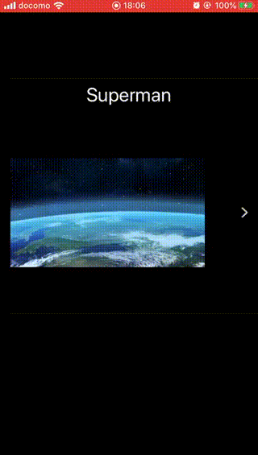

# GCVPVideoPlayerView
GCVPVideoPlayerView, is a video player built on SwiftUI, you can the video in a small cell and transfer it to a full screen view seamlessly

# How to use
Drop GCVPVideoPlayerView to your project, and create AVPlayer by `func createAvPlayer(url: String)` in `AVPlayerContainer` ,
and put `VideoPlayerRow` to your app's View, it will display video when it's ready.

# Demo  

